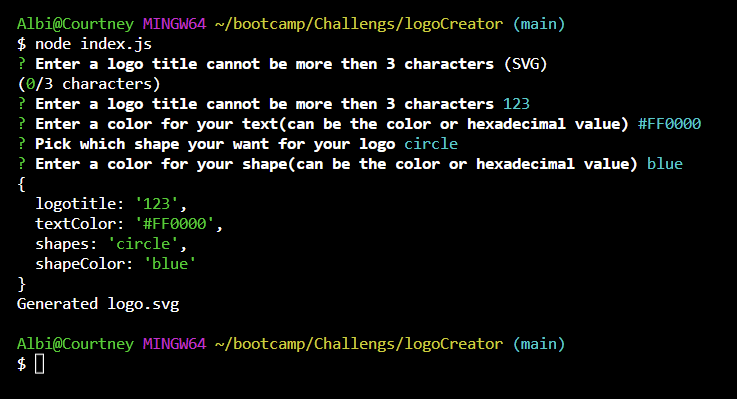
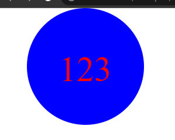
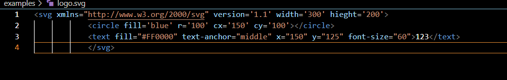

# logoCreator

## Badges

## Description

- Motivation: My motivation for this program was to create an easy way for myself or other companies to create there very own logo.
- Goal: I built this porject to test my comprehension on classes within javascript and if i fully knew there basic functionality.
- Problems Solved: The problems this program solves is making an easy an accesible way to creat a logo fast and cleanly for myself or others.
- What I Learned: The things I learned from this program was how to fully use class constructors and how the inheritence works. I learned trhouhg my T.A and tutor i was way off on how those work, after my tutoring seesion I know feel I have a much better understanding of it compared to before.

## Installation

- Jest
- Node.js
- Inquirer
- Inquirer-maxlength-input-prompt

## Usage

## Credits

N/A

## License

This program is done under the license: [MIT License](https://choosealicense.com/licenses/mit/)

## How To Contribute

## Questions

GitHub: https://github.com/Albikras

If you want to reach me with additional question click my email link here: Krasniqi1287@gmail.com

## Links

https://github.com/Albikras/logoCreator

## Video
